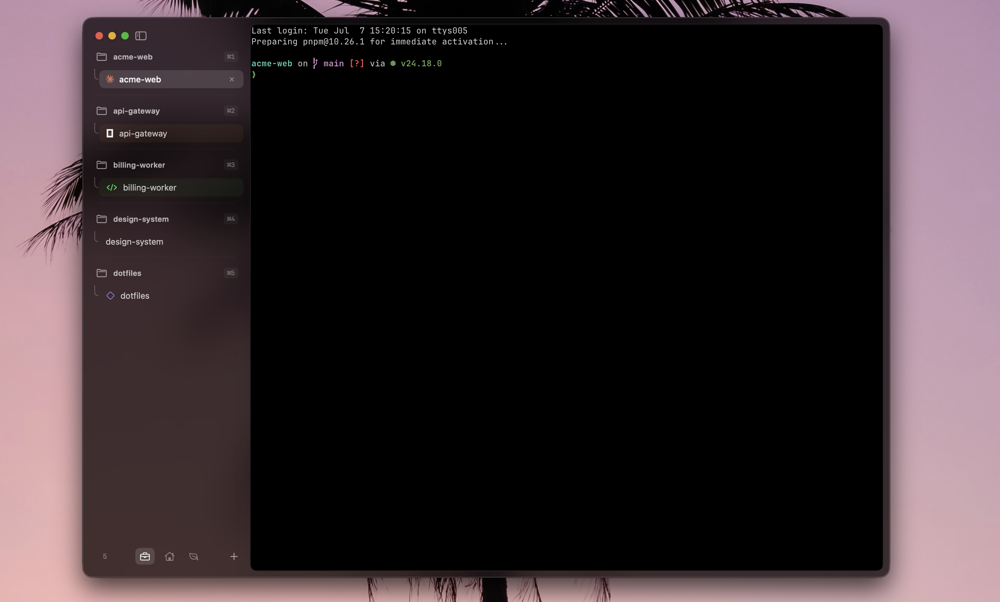

# Wave Terminal

> **I wrote 0 code for this.** Most of the code was written by Claude Opus 4.6 and GPT 5.4. I am not a professional in Swift, Zig, or terminal emulation. This is a proof of concept that I'm quite happy with.



A macOS terminal emulator built with SwiftUI, AppKit, and [libghostty](https://github.com/ghostty-org/ghostty) (the rendering engine behind Ghostty).

## Install

### Homebrew (recommended)

```bash
brew install shkumbinhasani/tap/wave
```

### Direct download

Download `wave-macos-arm64.zip` from [Releases](https://github.com/shkumbinhasani/wave/releases/latest), unzip, then **right-click → Open** (not double-click) on first launch. If you get "damaged and can't be opened", run:

```bash
xattr -cr /path/to/wave.app
```

Wave will offer to move itself to `/Applications` on first launch.

### Updates

Wave checks for updates automatically via Sparkle. You can also check manually from the menu bar: **Wave → Check for Updates...**

## Features

- **Glassy sidebar** with vibrancy and customizable theme (right-click to edit colors, brightness, vibrancy)
- **Directory-based tab grouping** — terminals are automatically grouped by working directory
- **Pinned groups** that persist across launches, with custom icons (auto-detects favicons) and names
- **Drag and drop** — reorder tabs within and between groups
- **Keyboard-first navigation** — Cmd+1-9 to focus a group, arrow keys to pick a tab, Enter to select
- **libghostty rendering** — GPU-accelerated terminal via Metal, full keyboard/mouse/IME support
- **Shell integration** — OSC 7 directory tracking, title updates, color scheme sync
- **Arc Browser-inspired UI** — custom traffic lights, resizable sidebar, rounded terminal surface
- **Auto-updates** via Sparkle

## Shortcuts

| Key | Action |
|-----|--------|
| Cmd+T | New tab (inherits current directory) |
| Cmd+W | Close tab |
| Cmd+1-9 | Focus sidebar group |
| Arrow keys | Navigate within focused group |
| Enter | Select tab / open terminal in empty group |
| Escape | Cancel group focus |
| Cmd+Q | Quit (with confirmation) |

## Build from source

```bash
# 1. Install dependencies
brew install zig xcodegen

# 2. Clone and build GhosttyKit
git clone --depth 1 https://github.com/ghostty-org/ghostty.git /tmp/ghostty
cd /tmp/ghostty
zig build -Demit-xcframework -Dxcframework-target=native --release=fast

# 3. Copy the framework
cd /path/to/wave
mkdir -p Frameworks
cp -R /tmp/ghostty/macos/GhosttyKit.xcframework Frameworks/

# 4. Generate Xcode project and build
xcodegen generate
xcodebuild -project wave.xcodeproj -scheme wave -configuration Release build
```

## License

MIT
